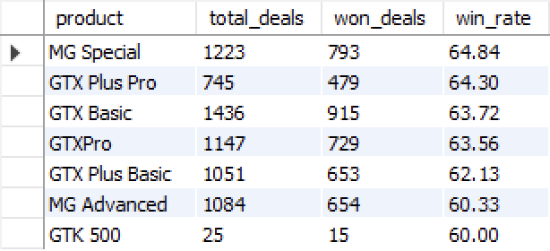
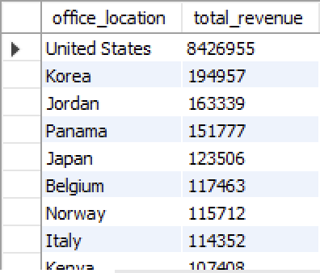
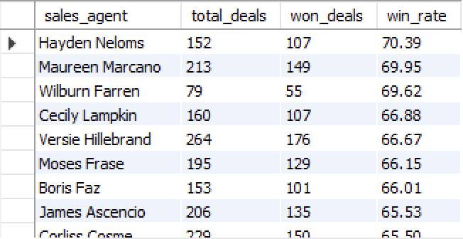

# CRM Sales Pipeline Analysis (MySQL)

## Project Overview

This project analyzes CRM sales data using MySQL to uncover insights related to:

- Sales pipeline trends
- Sales agent performance
- Product revenue analysis
- Account and regional performance

## Dataset

The project uses three datasets:

- accounts.csv
- sales_pipeline.csv
- sales_teams.csv

## Skills Demonstrated

- SQL Joins
- Aggregate Functions
- CASE Statements
- Window Functions
- Revenue Analysis
- KPI Reporting
- Business Intelligence Queries

## Tools Used

- MySQL
- GitHub
- Excel

## SQL Analysis Results

### Product Win Rates



### Revenue by Office Location



### Sales Agent Win Rates



## Example Query

```sql
SELECT
    sales_agent,
    ROUND(SUM(close_value), 2) AS total_revenue
FROM sales_pipeline
WHERE deal_stage = 'Won'
GROUP BY sales_agent
ORDER BY total_revenue DESC;
```

## Author

Bryan Paz
